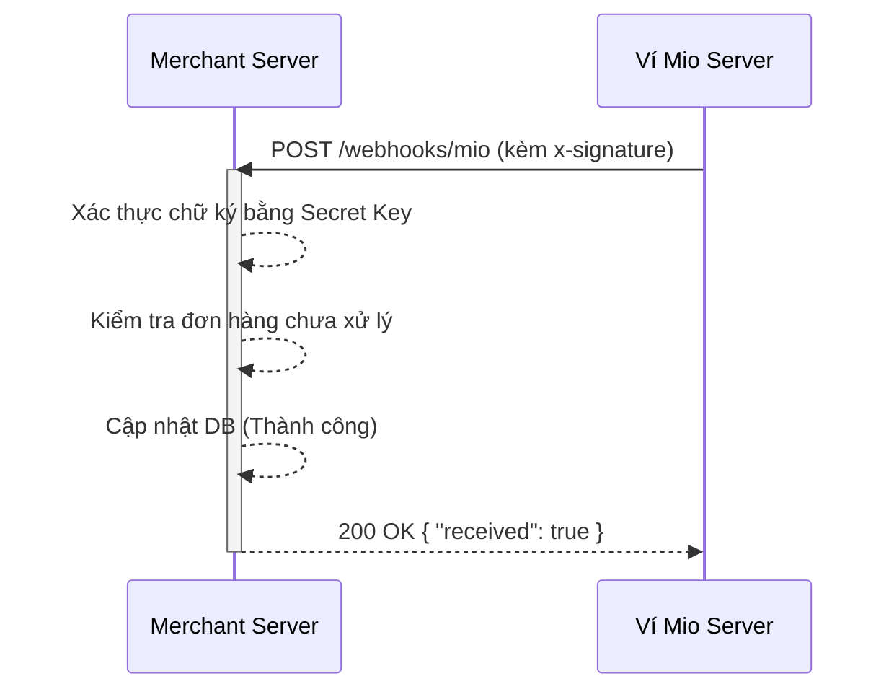

# 🚀 Ví Mio Payment Gateway — Hướng Dẫn Tích Hợp Nhanh

> Tài liệu dành cho **Developer của Merchant (Bên thứ 3)** tích hợp thanh toán qua Ví Mio (Website TMĐT, Cửa hàng ứng dụng, Mobile App...).

Tài liệu này hướng dẫn cách kết nối nhanh với Ví Mio để thực hiện các giao dịch thanh toán an toàn, chính xác và hiệu quả.

---

## 1. 🔑 Lấy API Key

Sau khi hồ sơ Merchant của bạn được duyệt trên hệ thống:

1. Đăng nhập vào **Merchant Portal**.
2. Truy cập mục **API Keys** → Chọn **Tạo Key mới**.

Hệ thống sẽ cung cấp cho bạn một cặp khóa:
- **`API Key` (Public Key)**: Bắt đầu bằng `pk_...`. Dùng để định danh Merchant.
- **`Secret Key` (Private Key)**: Bắt đầu bằng `sk_...`. Dùng để ký bảo mật các request.

> [!WARNING]
> **Bảo mật Secret Key**
> Secret Key chỉ hiển thị **một lần duy nhất**. TUYỆT ĐỐI KHÔNG đưa Secret Key lên Frontend (React, Vue...), Mobile App hoặc commit lên GitHub. Chỉ lưu và sử dụng tại Backend.

**Cấu hình biến môi trường (`.env`) tại Backend:**
```env
MIO_API_KEY=pk_test_xxx...
MIO_API_SECRET=sk_test_xxx...
MIO_BASE_URL=https://api.vimio.com/api/v1
```
*Lưu ý: Luôn thêm file `.env` vào `.gitignore`.*

---

## 2. 🔐 Xác Thực & Tạo Chữ Ký (Signature)

Hệ thống yêu cầu xác thực qua HTTP Headers. 

### API Thông Thường
Với các API truy vấn cơ bản, chỉ cần gửi API Key:
```http
x-api-key: pk_test_xxx
```

### API Giao Dịch Nhạy Cảm (Tạo đơn, Trừ tiền, Hủy đơn)
Để chống giả mạo dữ liệu và tấn công phát lại (Replay Attack), yêu cầu bổ sung 2 Headers:
```http
x-api-key: pk_test_xxx
x-timestamp: 1715678901234
x-signature: generated_signature
```

**Công thức tạo chữ ký:**
```text
HMAC_SHA256(timestamp + "." + JSON_body, secret_key)
```

**Ví dụ Code Node.js tạo chữ ký:**
```javascript
const crypto = require("crypto");

function createSignature(payload) {
  const timestamp = Date.now().toString();
  const body = JSON.stringify(payload); // JSON_body phải khớp 100% với body gửi đi

  const signature = crypto
    .createHmac("sha256", process.env.MIO_API_SECRET)
    .update(`${timestamp}.${body}`)
    .digest("hex");

  return { timestamp, signature, body };
}
```
> [!IMPORTANT]
> Khi gửi request, hãy chắc chắn sử dụng **đúng chuỗi JSON (`body`)** đã dùng để tạo chữ ký. Bất kỳ khoảng trắng thừa nào cũng có thể làm sai lệch chữ ký!

---

## 3. 💸 Tạo Giao Dịch Thanh Toán

Sau khi tạo chữ ký, bạn có thể gọi API tạo thanh toán.

```javascript
// 1. Chuẩn bị dữ liệu
const payload = {
  merchant_order_id: "ORDER_123", // Phải là duy nhất trong hệ thống của bạn
  amount: 50000
};

// 2. Tạo chữ ký
const { timestamp, signature, body } = createSignature(payload);

// 3. Gọi API Ví Mio
const response = await fetch(
  `${process.env.MIO_BASE_URL}/merchant/payments`,
  {
    method: "POST",
    headers: {
      "Content-Type": "application/json",
      "x-api-key": process.env.MIO_API_KEY,
      "x-timestamp": timestamp,
      "x-signature": signature
    },
    body
  }
);

const result = await response.json();
console.log(result);
```

---

## 4. 🔄 Nhận Kết Quả Qua Webhook (Bắt Buộc)

> [!CAUTION]
> **Không bao giờ** chỉ dựa vào dữ liệu trả về từ màn hình Frontend/Trình duyệt để xác nhận thanh toán thành công (rất dễ bị người dùng can thiệp). Kết quả cuối cùng **phải được kiểm tra và ghi nhận từ Webhook** do server Ví Mio gọi sang.

Merchant cần tạo một API (Webhook) để nhận thông báo trạng thái đơn hàng:
```http
POST https://api.your-domain.com/webhooks/mio
```
*Đừng quên cấu hình URL này trong Merchant Portal!*

### Luồng xử lý Webhook chuẩn:
1. **Kiểm tra chữ ký** Webhook từ Ví Mio (để đảm bảo không bị giả mạo).
2. **Kiểm tra đối chiếu** `merchant_order_id` và số tiền (`amount`).
3. **Idempotency (Tránh lặp)**: Chỉ cập nhật trạng thái nếu đơn hàng *chưa được xử lý*.
4. **Trả về HTTP `200`** sớm nhất có thể với body `{ "received": true }` để báo cho Ví Mio biết bạn đã nhận thành công.



---

## 5. 🚫 Bảng Mã Lỗi Thường Gặp (Error Codes)

| HTTP | Ý Nghĩa | Nguyên Nhân Khả Dĩ |
| :--- | :--- | :--- |
| `400` | **Bad Request** | Dữ liệu không hợp lệ, sai định dạng, hoặc vượt hạn mức giao dịch. |
| `401` | **Unauthorized** | Thiếu API Key, sai chữ ký (Signature không khớp), hoặc Timestamp quá hạn (lệch giờ). |
| `403` | **Forbidden** | Merchant chưa được duyệt, bị khóa, hoặc API Key đã bị thu hồi. |
| `404` | **Not Found** | Không tìm thấy giao dịch hoặc đơn hàng. |
| `409` | **Conflict** | Mã đơn hàng (`merchant_order_id`) đã tồn tại. |
| `500` | **Internal Error**| Lỗi hệ thống từ Ví Mio. Bạn nên retry lại sau một khoảng thời gian. |

---

## 6. 🛡️ Check-list Bảo Mật Trước Khi Lên Production

- [ ] **KHÔNG** lưu Secret Key trong Source code hoặc commit file `.env`.
- [ ] **KHÔNG** tạo chữ ký (Signature) tại Frontend/Mobile App.
- [ ] **CÓ** xử lý Webhook theo cơ chế Idempotent (kiểm tra trạng thái cũ trước khi cập nhật) để tránh cộng tiền hoặc xử lý đơn hàng nhiều lần.
- [ ] Nếu nghi ngờ Secret Key bị lộ, hãy lên Portal **Thu hồi (Revoke)** và cấp lại Key ngay lập tức.

---

## 📞 Hỗ Trợ Kỹ Thuật

💡 **Lời khuyên:** Hãy tích hợp và kiểm thử đầy đủ các luồng lỗi trên môi trường **Sandbox** trước khi xin cấp **Production Key**.

Để xem chi tiết tất cả các endpoint (Request/Response models), vui lòng tham khảo **Swagger API Documentation**.
Nếu cần trợ giúp, hãy liên hệ đội ngũ Admin qua email hỗ trợ của Ví Mio.
